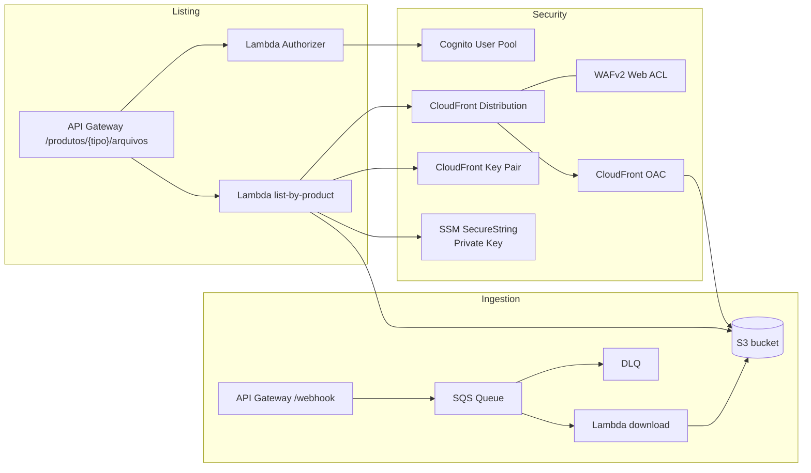

# Webhook Downloader + Listing API

Este repositorio provisiona uma pipeline de ingestao via API Gateway/SQS/Lambda para baixar arquivos no S3 e um endpoint autenticado que lista arquivos por tipo de produto e gera cookies assinados do CloudFront para download seguro.

## Arquitetura



## Requisitos

- Terraform >= 1.3
- AWS CLI configurado (profile `sintegre`)
- OpenSSL instalado
- Permissoes para criar recursos em S3, SQS, Lambda, API Gateway, Cognito, CloudFront, WAF e SSM

## Principais recursos

- `POST /webhook` -> envia payload para a fila SQS
- Lambda download -> baixa a URL e grava no S3 em `data/tipo/arquivo`
- `GET /produtos/{tipo}/arquivos` -> lista objetos e gera cookies assinados do CloudFront
- Lambda Authorizer -> valida Access Token do Cognito
- CloudFront + OAC + WAF -> acesso privado ao S3

## Padrão de chaves no S3

Por padrao o prefixo e `"{date}/{product}"`, compatível com o formato atual:

```
2024-01-01/avaliacao-da-operacao/arquivo.pdf
```

Se quiser mudar, edite `var.s3_prefix_template`.

## Como usar

1) Gere as chaves do CloudFront localmente:
```bash
terraform -chdir=terraform apply -target=null_resource.cloudfront_keys
```

2) Rode o apply completo:
```bash
terraform -chdir=terraform apply
```

3) Pegue os outputs:
```bash
terraform -chdir=terraform output
```

## Autenticacao e chamada do endpoint

O Terraform cria um User Pool e um usuario de teste. A senha inicial e temporaria e exige troca.

1) Login (troca de senha se necessario):
```bash
aws cognito-idp admin-initiate-auth \
  --user-pool-id <USER_POOL_ID> \
  --client-id <CLIENT_ID> \
  --auth-flow ADMIN_USER_PASSWORD_AUTH \
  --auth-parameters USERNAME=test.user@example.com,PASSWORD=Temp#1234
```

Se vier `NEW_PASSWORD_REQUIRED`, finalize:
```bash
aws cognito-idp admin-respond-to-auth-challenge \
  --user-pool-id <USER_POOL_ID> \
  --client-id <CLIENT_ID> \
  --challenge-name NEW_PASSWORD_REQUIRED \
  --challenge-responses USERNAME=test.user@example.com,NEW_PASSWORD=NovaSenha#1234 \
  --session <SESSION>
```

2) Chame o endpoint:
```bash
curl -H "Authorization: Bearer <ACCESS_TOKEN>" \
  "https://<API_ID>.execute-api.us-east-1.amazonaws.com/prod/produtos/<tipo>/arquivos?data=2026-01-21"
```

`<tipo>` deve ser o `macroProcesso` em kebab-case (ex: `avaliacao-da-operacao`).

## Download via CloudFront

O endpoint retorna `Set-Cookie` com `CloudFront-Policy`, `CloudFront-Signature` e `CloudFront-Key-Pair-Id`, alem das URLs dos arquivos.

Exemplo com `curl`:
```bash
curl -H "Cookie: CloudFront-Policy=...; CloudFront-Signature=...; CloudFront-Key-Pair-Id=..." \
  "https://<CLOUDFRONT_DOMAIN>/<data>/<tipo>/<arquivo>" -o arquivo.pdf
```

No navegador, basta chamar o endpoint primeiro para receber os cookies e abrir o link do CloudFront.

## Variaveis importantes

- `cloudfront_private_key_ssm_param` (default: `/webhook/cloudfront/private-key`)
- `cloudfront_public_key_pem` (opcional se usar o arquivo gerado)
- `s3_prefix_template` (default: `{date}/{product}`)
- `cloudfront_web_acl_id` (default para Web ACL existente, pode sobrescrever)
